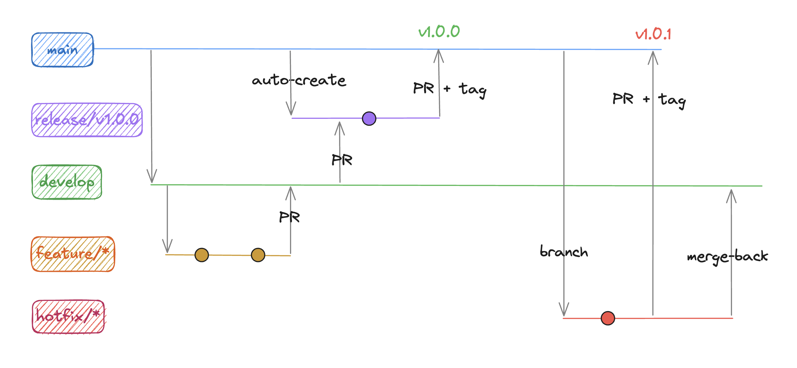

<p align="right">
  
  
  
  
  
  
  
</p>

# SRM Credit Engine

## Git Flow

O projeto adota o Git Flow. A decisão considera que o produto é um serviço empacotado e versionado, com versionamento semântico manual e releases controladas, com fluxo de Continuous Integration bloqueante definido. Continuous Deployment não é uma opção válida ao escopo do projeto.

Trunk Based não é uma opção válida para o projeto dado não possuir feature flags ou necessitar de controle de release. O caso se extende ao GitHub Flow (somente `main` + features), por não oferecer linha de integração estável nem branch de estabilização de release, expondo `main` a código instável em um domínio sensível.


#ParaTodosVerem: A imagem demonstra o Git Flow, decrito em [Fluxo](#fluxo)

### Branches

| Branch | Origem | Merge | Função |
| --- | --- | --- | --- |
| `main` | — | recebe `release/*` e `hotfix/*` | Produção. Sempre estável e releasable |
| `release/vX.Y.Z` | `main` (automática) | `main` | Snapshot imutável de estabilização e bump de versão |
| `develop` | `main` | recebe `feature/*` e `hotfix/*` | Linha de integração das features |
| `feature/*` | `develop` | `develop` | Desenvolvimento de funcionalidades |
| `hotfix/vX.Y.Z` | `main` | `main` e merge-back em `develop` | Correção urgente em produção |

### Fluxo

1. **`feature/*`** é criada a partir de `develop`, desenvolvida e integrada via PR.
2. Todo merge em `develop` com conteúdo diferente de `main` e **sem PR aberto de `release/*` para `main`** dispara a criação automática de **`release/vX.Y.Z`** a partir de `main` (bump patch a partir da última tag).
3. Enquanto existir PR aberto de `release/*` para `main`, nenhuma nova release é criada — a release ativa guarda o estado e recebe o conteúdo de `develop` via PR.
4. **`release/vX.Y.Z`** é estabilizada e mergeada na `main` via PR.
5. O merge na `main` gera automaticamente a **tag `vX.Y.Z`** e a **GitHub Release**.
6. **`hotfix/vX.Y.Z`** nasce de `main`, corrige produção e retorna para `main` (tag) e `develop` (merge-back).

## Estrutura do Projeto

Repositório único com aplicativos independentes e infraestrutura local:

```
.
├── backend/              # Spring Boot 3 (Java 21, Maven, Maven Wrapper)
├── frontend/             # React 18 (Vite, TypeScript strict, pnpm)
├── .github/workflows/    # CI, release e criação automática de branches
├── docker-compose.yml    # PostgreSQL 16 local
└── .docs/                # Documentação técnica e planos
```

Cada aplicativo tem build, testes e ciclo de release próprios; o repositório concentra a fonte e a automação, sem impor release sincronizada entre eles.

### Backend — Arquitetura Hexagonal

```
backend/src/main/java/com/srm/creditengine/
├── application/          # casos de uso e portas (in/out)
├── domain/               # modelos e regras de negócio
└── infrastructure/       # adapters (web, persistência) e configuração
```

- `GET /api/health` → `{"status":"UP"}` (contrato inicial da API).
- Swagger/OpenAPI em `/swagger-ui.html` (springdoc).
- Testes de integração com Testcontainers (PostgreSQL isolado).
- Gate de cobertura JaCoCo ≥ 90% no `./mvnw verify`.
- Configuração por variáveis de ambiente (`DB_URL`, `DB_USERNAME`, `DB_PASSWORD`, `PORT`).

### Frontend — Organização por Features

```
frontend/src/
├── app/            # bootstrap, providers
├── components/     # componentes visuais reutilizáveis
├── features/       # funcionalidades por domínio de interface
├── pages/          # composição de telas
├── lib/api/        # cliente HTTP tipado
├── state/          # estado global de cliente (Zustand, quando necessário)
├── styles/         # tokens e estilos globais
└── test/           # setup e servidor MSW
```

- TanStack Query para dados do servidor; formulários com React Hook Form + Zod.
- Testes com Vitest + React Testing Library + MSW; E2E com Playwright.
- Configuração pública via `VITE_*` (ver `frontend/.env.example`).

### Execução local

Infraestrutura (PostgreSQL 16):

```bash
docker compose up -d
```

Backend (porta 8080):

```bash
cd backend && ./mvnw spring-boot:run
```

Frontend (dev server):

```bash
cd frontend && pnpm install && pnpm dev
```

## Gestão de Crise e Rollback

Um bug crítico em produção é tratado com hotfix, mas nem toda correção chega a tempo — às vezes a decisão é **reverter** a alteração. Reverter em `main` é a estratégia de rollback preferida quando a correção não pode ser desenvolvida e validada no tempo necessário.

A recomendação segura é reverter antes (git revert) para estabilizar o ambiente e, posteriormente, desenvolver um hotfix para corrigir o bug de maneira consistente.

### Reverter com segurança

1. Identifique o merge problemático no histórico:
   ```bash
   git log --oneline -10
   ```
2. Reverta o merge criando um novo commit (não reescreva o histórico):
   ```bash
   git revert -m 1 <sha-do-merge>
   ```
3. Envie e abra PR para `main` como qualquer outra mudança:
   ```bash
   git push
   ```

### Por que `git revert` e não `git reset`

- **`git revert`** cria um commit novo desfazendo a alteração. O histórico permanece íntegro — essencial para rastreabilidade e para o fluxo de release, pois outros commits e branches já dependeram do código.
- **`git reset --hard`** apaga o histórico e gera conflitos irreversíveis na `main` compartilhada, quebrando a integridade das tags e releases já publicadas.

### Recomendações

- Reverta o **merge** com `-m 1` para preservar a primeira parentagem; depois sincronize `develop` com a correção.
- Após o revert, o bug continua existindo no código — trate-o em `hotfix/*` ou `feature/*` na sequência.
- Evite reverter um commit já revertido sem validação, pois os commits podem se anular silenciosamente.
