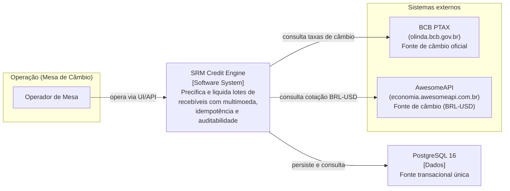
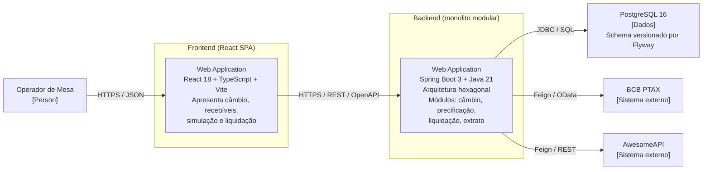
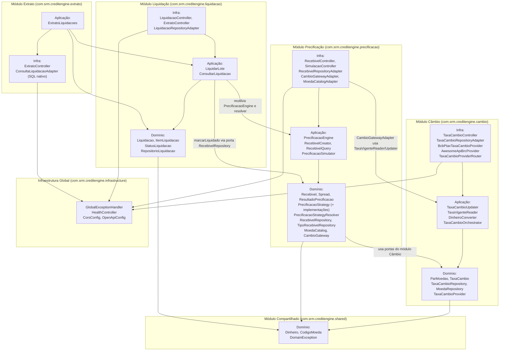
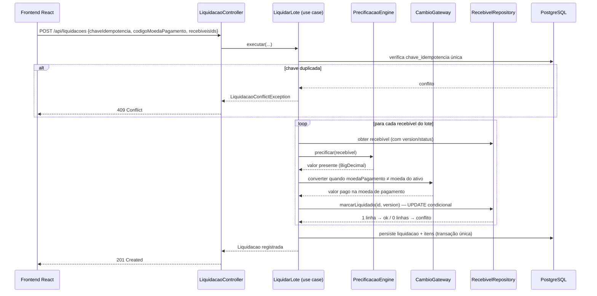
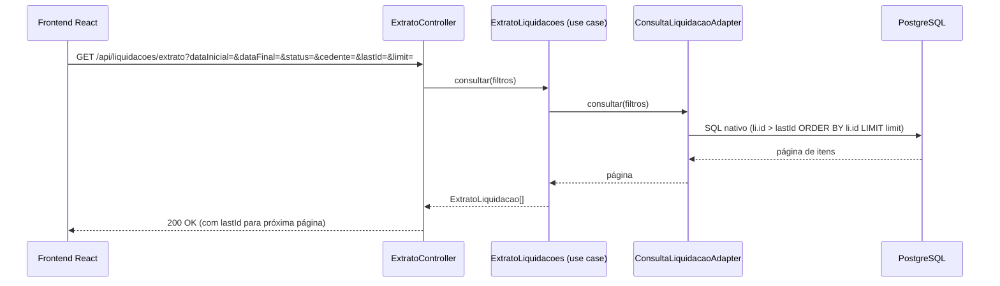
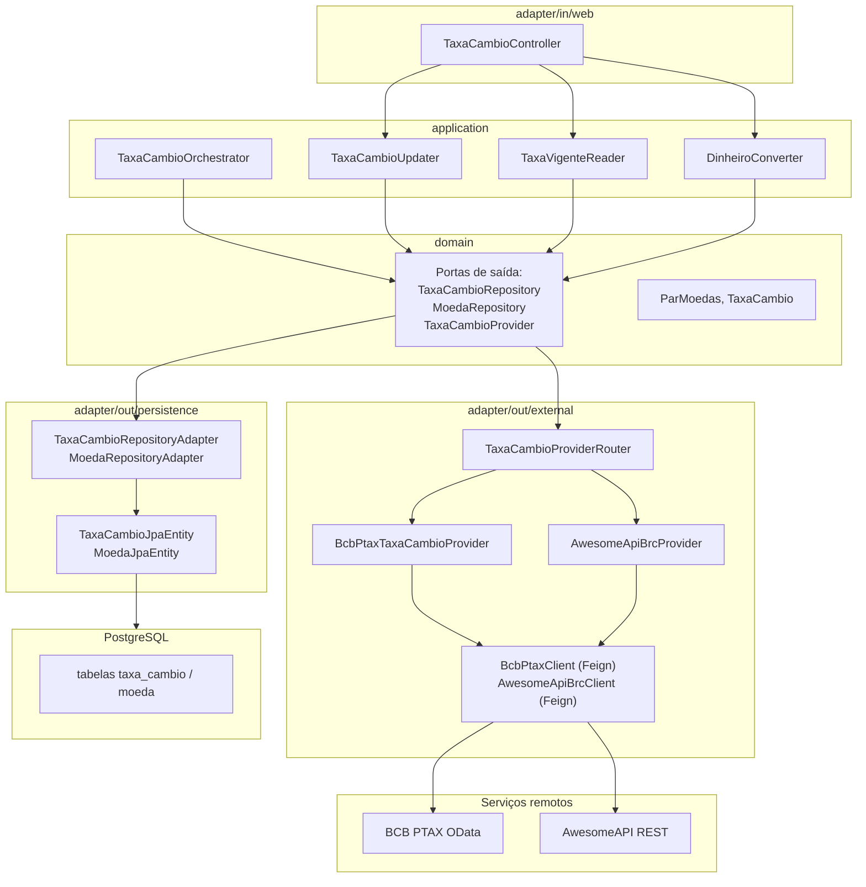

# Diagrama C4 de Arquitetura — SRM Credit Engine

Este documento descreve a arquitetura do SRM Credit Engine seguindo o modelo C4 (Contexto → Containers → Componentes → Código), a partir da estrutura real do código-fonte. Os diagramas usam Mermaid e são renderizados nativamente pelo GitHub.

---

## 1. Diagrama de Contexto (Nível 1)

O sistema no centro de seu ambiente: quem o utiliza e com quais sistemas externos se relaciona.

**Escopo:** o SRM Credit Engine é o sistema-alvo; o frontend (React) e o backend (Spring Boot) são descritos internamente nos níveis seguintes. O operador de mesa é o ator principal.

---

## 2. Diagrama de Containers (Nível 2)

A divisão em aplicações/deployables executáveis e o banco de dados.

**Decisões estruturais:**

- **Monolito modular**: um único processo Spring Boot com bounded contexts isolados por pacote (`cambio`, `precificacao`, `liquidacao`, `extrato`), comunicando-se por portas/contratos internos — ver `architecture_decision_records-architecture_definition.md`.
- **Banco único**: PostgreSQL como fonte transacional para os dois bounded contexts (transacional + analítico), sem réplicas — ver `architecture_decision_records-db_definition.md`.
- **Frontend independente**: SPA separada consumindo a API via REST; CORS liberado por configuração (`CORS_ALLOWED_ORIGINS`).

---

## 3. Diagrama de Componentes (Nível 3)

Os componentes internos do backend, organizados por módulo hexagonal. Cada módulo segue o mesmo padrão: `domain` (entidades/VOs/portas), `application` (casos de uso) e `infrastructure` (adapters web/persistência/externos).

### 3.1 Visão geral dos módulos e dependências

### 3.2 Fluxo de uma liquidação (fluxo principal)

### 3.3 Fluxo de consulta de extrato

---

## 4. Diagrama de Código (Nível 4)

No nível 4, o detalhe mais útil é o padrão hexagonal aplicado de forma consistente em **todos** os módulos. Um exemplo representativo do módulo Câmbio:

A regra é uniforme nos demais módulos: **a aplicação depende de portas (interfaces) no domínio; a infraestrutura implementa essas portas** — o fluxo de dependências aponta sempre para o núcleo, nunca do domínio para a infraestrutura.

---

## 5. Referências

- [TechDoc](TechDoc.md) — documentação técnica completa por módulo (contratos, persistência, configuração).
- [Decisões de Arquitetura](architecture_decision_records-architecture_definition.md) — racional da topologia (monolito modular × microserviços) e do repositório único.
- [Banco de Dados](architecture_decision_records-db_definition.md) — decisão do PostgreSQL (CAP/PACELC, ACID).
- [Decisões de Precificação e Liquidação](architecture_decision_records-precificacao_liquidacao.md) — Strategy, precisão e optimistic locking.
- [Modelo de Dados](database_model.md) — ER, DDL e convenções do schema.